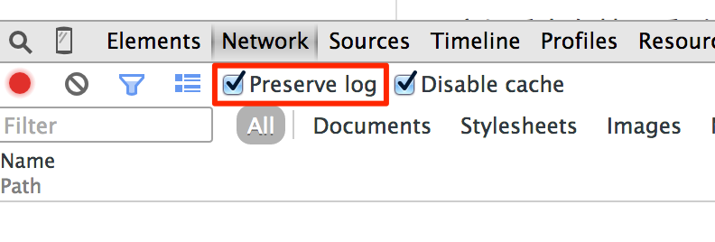
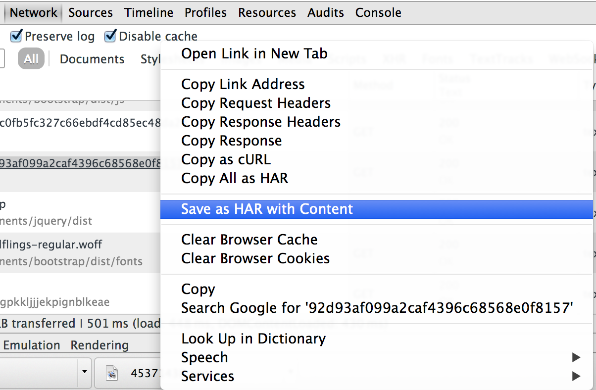

#如何创建签到模板

**大坑，慎入**

您可能需要知道

* HTTP 协议
* Web Service 原理（cookie，session，header等）
* Javascript

##准备工作

1. 2个尚未签到的帐号，如果没有只能分两天进行了（或者到 [bugmenot.com](http://bugmenot.com/) 上碰运气）
2. 一个 Chrome 浏览器

## 登录开始前

1. 打开 Chrome，**新建隐身窗口(重要)**
3. 打开开发者工具（`ctrl+shift+I`，或者 鼠标右键 > 审查元素）
4. 切换到 Network（网络）面板，**勾选 Preserve log (非常重要)**

5. 因为非常重要，再说一遍，勾选 Preserve log （保留请求日志）

## 开始登录

1. 输入登录页面，输入用户名密码登录
2. **直奔签到页**，完成签到

## 保存 HAR

在 Network 面板中，右键点击任何一个请求，选 Save as HAR with Content 
将文件保存到本地

## 上传至签到

1. [qiandao.today/har/edit](https://qiandao.today/har/edit) 将刚才保存的 HAR 文件上传。
2. 填写**登录时**用的用户名、密码（用户名密码不会被保存，只用于查找请求中的用户名、密码）
3. 猜猜看哪些请求是登录和签到必要的。经验上，以下请求是必要的：
   * 登录页面
   * 登录页面的POST
   * 发出用户名、密码的请求
   * 发送后导致页面跳转的页面
   * 翻页前后的第一个页面

## 编辑器使用

1. 将用户名、密码、Cookie、header 等根据用户变化的部分，用类似 `{{ username }}` 的模板替换。（模板支持 jinja2 语法）
2. 使用请求编辑中的测试面板，测试模板返回是否正确，分别使用正确的和错误的用户名进行测试，填写正确/错误断言。有助于发现签到失败和模板失效。
3. 请求中需要上一个请求中的某些数据时，使用变量提取，通过正则提取数据保存在环境变量中。使用 `ab(\w+)cd`，组选择器，选择其中的一部分。
4. 当完成所有请求编辑之后，使用下载按钮旁的测试，进行整体测试。
5. 编辑中的 HAR 会自动保存在浏览器缓存中，不用担心会丢失。

# TIPS

### 登录过程中密码被加密了怎么办？

首先**尝试寻找 wap 版的页面**，往往页面会比较简单。如果您能破解加密方法，可以写成一个函数，在模板中调用。

### 如果登录需要验证码怎么办？

目前没办法，只能通过 Cookie 验证绕过。

### 我的用户名，密码会泄露吗？

为了帮用户发出请求，用户名、密码终究需要被记录的，这只能靠服务器维护者自律。但在存储时，使用每个用户均不相同的密钥加密。通过主程序密钥对用户密钥加密，保证在仅获得数据库是无法解出用户数据。（加密的用户数据包括用户上传的模板，用户为登录设置的变量）

如果您依然担心，可以自行搭建系统，下载模板在您自己的服务器上运行签到。